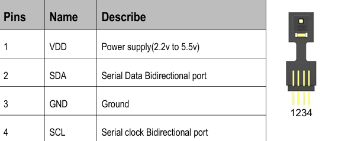

## Overview
This package provides a ROS 2 (Robot Operating System) node for reading temperature and humidity data from the AHT25 sensor over I2C. It continuously reads measurements from the sensor and publishes the data to a ROS 2 topic. The data is logged and made available in the form of a String message for easy integration with other ROS 2 nodes.

## Pinout

